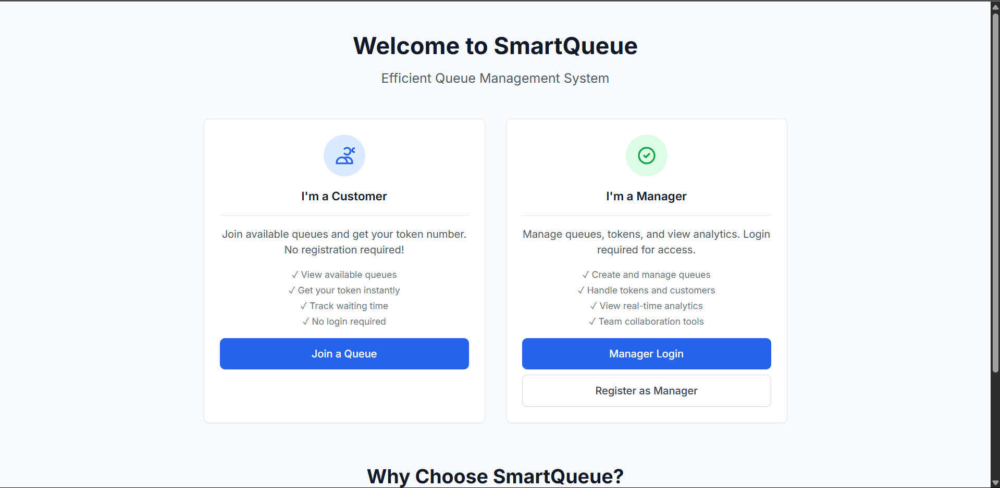
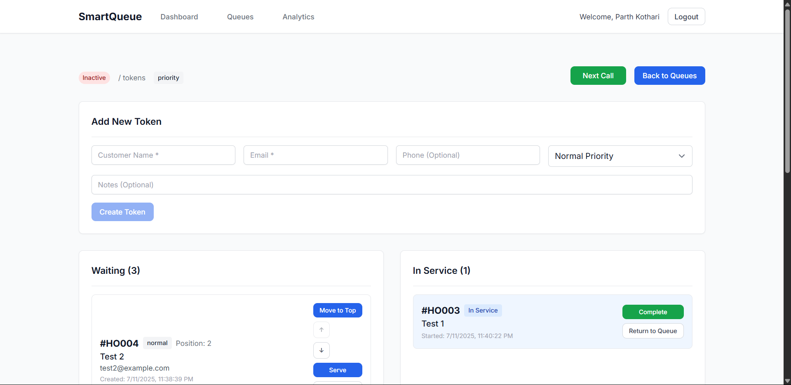
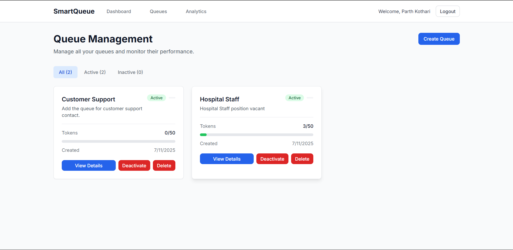
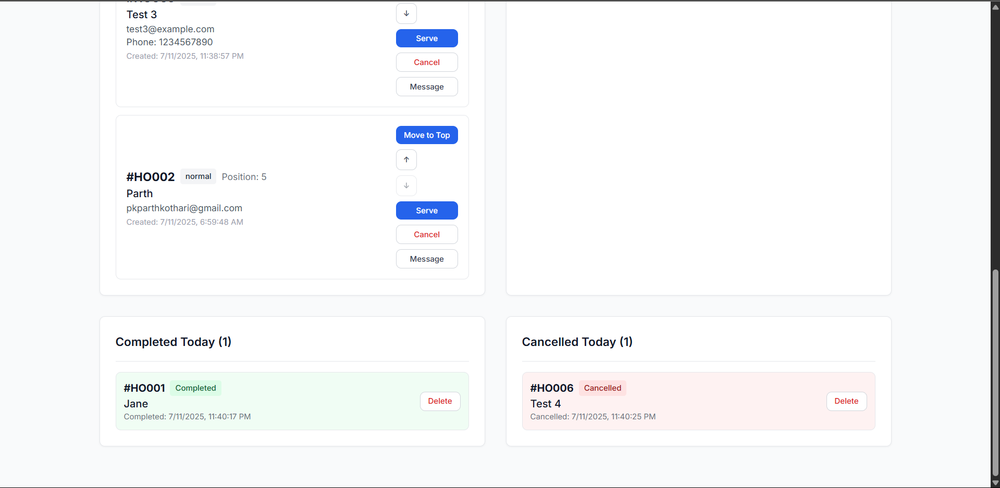
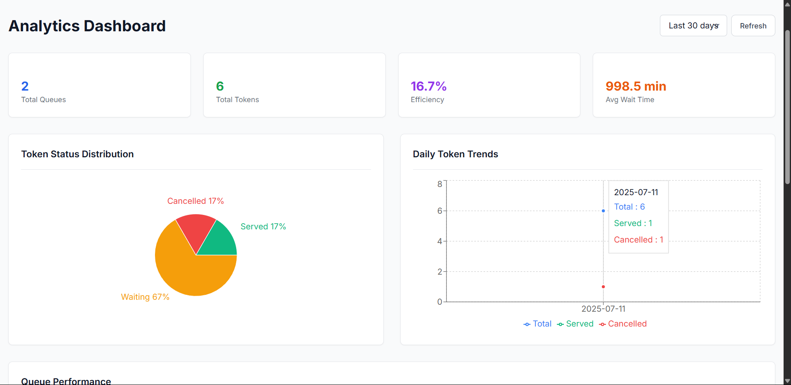

# 🎯 Smart Queue Management System

A modern, real-time queue management system built with Next.js, Node.js, and MongoDB. Perfect for businesses, Hospitals, clinics, banks, and any organization that needs efficient customer queue management.


## ✨ Features

- **Real-time Queue Updates** - Live queue status with Socket.IO
- **Digital Token Generation** - digital tokens
- **Multi-Queue Support** - Manage multiple service queues
- **User Authentication** - Secure login and registration
- **Analytics Dashboard** - Queue performance insights
- **Mobile Responsive** - Works on all devices
- **Admin Panel** - Complete queue management controls

## 📸 Screenshots

### Sign In



### Dashboard



### Queue Management






### Analytics



---

## 📦 Environment Variables

You must configure environment variables for both backend and frontend. Copy `.env.example` to `.env` for development, and `.env.production` for production deployments. Fill in the required values as described below:

**Core variables (required for all environments):**

- `MONGODB_URI` – MongoDB connection string
- `JWT_SECRET` – Secret key for JWT authentication
- `FRONTEND_URL` – Frontend base URL (e.g., http://localhost:3000 or your production domain)
- `BACKEND_URL` – Backend API base URL (e.g., http://localhost:5001 or your production API domain)

**Email sending (backend SMTP):**

- `SMTP_HOST` – SMTP server host (for backend email notifications)
- `SMTP_PORT` – SMTP server port
- `SMTP_USER` – SMTP username
- `SMTP_PASS` – SMTP password

**Email sending (frontend EmailJS, optional):**

- `EMAIL_JS_SERVICE_ID` – EmailJS service ID (if using EmailJS for frontend email sending)
- `EMAIL_JS_TEMPLATE_ID` – EmailJS template ID
- `EMAIL_JS_PUBLIC_KEY` – EmailJS public key

See `.env.example` for all required variables and descriptions. For production, ensure secrets and credentials are kept secure and never committed to version control. Use `.env.production` for your production environment variables.

---

## 🚀 Quick Start (Local Development)

### Prerequisites

- Node.js 18+ installed
- Docker and Docker Compose installed
- Git installed

### 1. Clone the Repository

```bash
git clone https://github.com/pkparthk/smart-queue-management.git
cd smart-queue-management
```

### 2. Setup Environment

```bash
# Copy environment template
cp .env.example .env

# Install all dependencies (backend & frontend)
npm run install-all
```

> **Note:** Ensure you fill in the required environment variables in `.env` before starting the app.

### 3. Start with Docker (Recommended)

```bash
# Start all services (frontend, backend, MongoDB)
npm start

# Or manually with docker-compose
docker-compose up -d
```

### 4. Access the Application

- **Frontend:** http://localhost:3000
- **Backend API:** http://localhost:5001
- **MongoDB:** mongodb://localhost:27017

---

### 5. Manual Local Development (Without Docker)

You can run backend and frontend separately for development:

```bash
# In one terminal (backend)
cd backend
npm install
npm run dev

# In another terminal (frontend)
cd frontend
npm install
npm run dev
```

### 6. Troubleshooting & FAQ

- If you encounter port conflicts, ensure ports 3000 (frontend), 5001 (backend), and 27017 (MongoDB) are free.
- For environment variable issues, double-check your `.env` file.
- For Docker issues, ensure Docker Desktop is running and up to date.

---

## 🚀 Deployment

You can deploy this project to any cloud or on-premise environment that supports Docker. For Azure, Vercel, or other platforms, see `DEPLOYMENT.md` for step-by-step instructions.

---

## 📖 API Documentation

The backend exposes a RESTful API for all queue, token, and user operations. For detailed API endpoints and usage, see the [API Docs](./backend/README.md) or use tools like Postman to explore `/api` routes.

---

## 🧩 Additional Libraries & Features

- **Zustand** – Lightweight state management for the frontend (used in `frontend/src/store/authStore.ts`)
- **Jest** – Testing framework for backend unit/integration tests
- **Socket.IO** – Real-time communication between backend and frontend
- **Email Service Utility** – For notifications (see `utils/emailService.ts` in both backend and frontend)
- **Custom Middleware** – For authentication, error handling, and more

## 🛠 Technology Stack

### Frontend

- **Next.js 14** - React framework with App Router
- **TypeScript** - Type-safe development
- **Tailwind CSS** - Utility-first styling
- **Socket.IO Client** - Real-time updates

### Backend

- **Node.js** - JavaScript runtime
- **Express.js** - Web framework
- **TypeScript** - Type-safe development
- **Socket.IO** - Real-time communication
- **JWT** - Authentication
- **Bcrypt** - Password hashing

### Database

- **MongoDB** - NoSQL database
- **Mongoose** - MongoDB object modeling

### DevOps

- **Docker** - Containerization
- **Docker Compose** - Multi-container orchestration

## 📁 Project Structure

```
smart-queue-management/
├── backend/
│   ├── src/
│   │   ├── controllers/
│   │   ├── models/
│   │   ├── routes/
│   │   ├── middleware/
│   │   ├── socket/
│   │   └── server.ts
│   ├── config/
│   ├── Dockerfile
│   ├── package.json
│   └── tsconfig.json
├── frontend/
│   ├── src/
│   │   ├── app/
│   │   ├── components/
│   │   ├── hooks/
│   │   ├── store/
│   │   └── styles/
│   ├── Dockerfile
│   ├── package.json
│   └── tsconfig.json
├── .env.example
├── DEPLOYMENT.md
└── README.md
```

## 🎯 Key Features Explained

### 🏪 Queue Management

- Create and manage multiple queues
- Set queue capacity and estimated wait times
- Real-time queue status updates

### 🎫 Token System

- Generate digital tokens
- Token validation and verification
- Automatic queue position tracking

### 📊 Analytics

- Queue performance metrics
- Wait time analysis
- Service efficiency reports

### 👥 User Roles

- **Admin:** Full system management
- **Staff:** Queue operations and token management
- **Customer:** Token generation and queue status

## ✉️ Email Notification & Generation

- The system includes an email service utility for sending notifications to users (e.g., token confirmations, queue updates, password resets, and other alerts).
- Email logic is implemented in both backend and frontend utilities (`utils/emailService.ts`).
- Email sending is typically handled via SMTP; you must configure SMTP credentials in your `.env` file (see `.env.example`).
- The email utility is designed to be extensible—customize templates and triggers as needed for your business logic.
- Example use cases:
  - Send a confirmation email when a user generates a new token.
  - Notify users of their queue position or estimated wait time.
  - Alert admins or staff of important queue events.
- This feature helps keep users informed in real time about their queue status, token details, and important system events.

> **Note:** For email features to work, ensure your environment variables for SMTP (host, port, user, password, etc.) are set up correctly.

---

## 🔐 Security Features

- JWT-based authentication
- Password hashing with bcrypt
- Input validation and sanitization
- CORS protection
- Rate limiting (configurable)

## 📱 Mobile Support

- Responsive design for all screen sizes
- Touch-friendly interface

## 🤝 Contributing

1. Fork the repository
2. Create a feature branch (`git checkout -b feature/amazing-feature`)
3. Commit your changes (`git commit -m 'Add amazing feature'`)
4. Push to the branch (`git push origin feature/amazing-feature`)
5. Open a Pull Request

## 🙏 Acknowledgments

- Built with modern web technologies
- Inspired by real-world queue management needs
- Community-driven development

---

**⭐ Star this repository if you find it helpful!**

Made with ❤️ for efficient queue management
